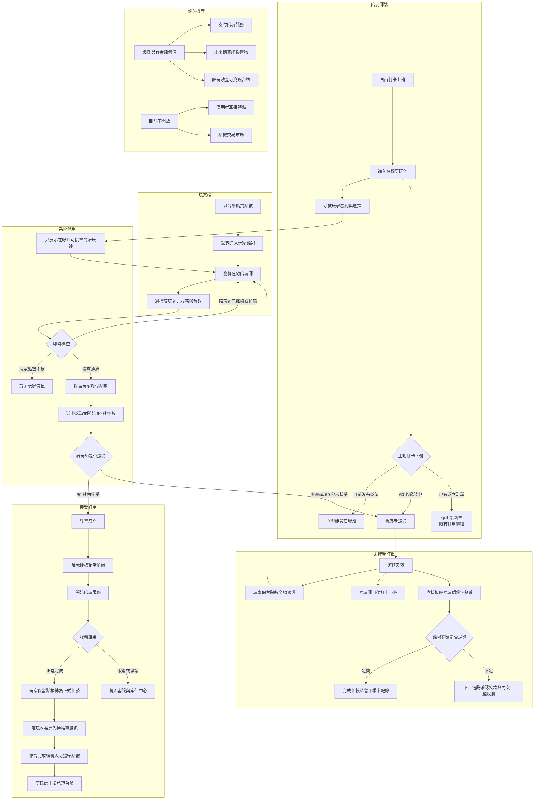
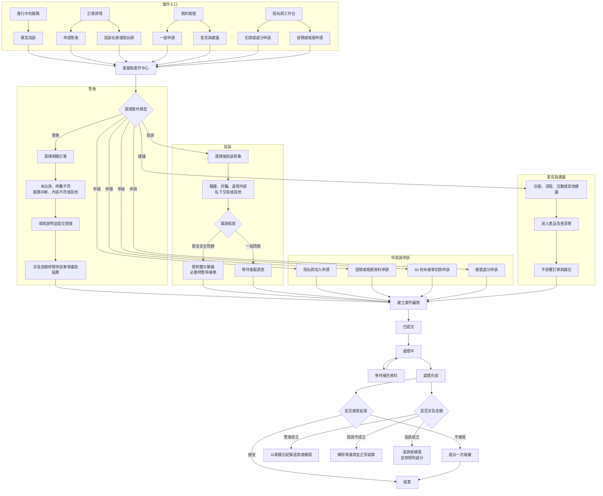

# 打卡、派單、錢包與客服案件流程藍圖

- 藍圖版本：v0.6
- 保存日期：2026-07-19
- 文件性質：產品流程附件，不代表所有功能均已實作
- 實作現況：金錢點數帳務基礎、`/wallet` 與私人 `/live` Demo 已完成；打卡、在線池、玩家點數保留、60 秒接受／拒絕／逾時、返點與陪玩師下線均可操作。正式登入、背景排程器、陪玩師逾時扣點、完整服務生命週期及客服案件中心仍未實作。

## 1. 已確認產品規則

1. 陪玩師可以隨時打卡上班、隨時打卡下班。
2. 系統只展示或推薦已打卡上班且可接單的陪玩師，由玩家自行選擇。
3. 玩家選定陪玩師與服務後，系統先保留玩家應付點數，再送出 60 秒邀請。
4. 陪玩師在 60 秒內接受，訂單成立；服務完成後才正式扣除玩家保留點數並進入陪玩收益結算。
5. 陪玩師拒絕或 60 秒內未接受，玩家保留點數全額返還、陪玩師自動下線，並直接扣除陪玩師錢包點數。
6. 點數具有金錢價值：玩家以台幣購買、可支付服務、未來可購買虛擬禮物，陪玩收益可依規則兌現台幣。
7. 目前不開放使用者互相轉點或點數交易市場。
8. 售後、投訴、申請、申訴與建議統一進入「客服與案件中心」，但保留各自的情境入口。

## 2. 打卡、派單與錢包主流程

## 3. 售後、投訴、申請與建議流程

## 4. 介面位置

- 「進行中的服務」：緊急投訴。
- 「訂單詳情」：申請售後、投訴玩家或陪玩師、查看相關案件。
- 「我的帳號」：客服與案件、一般申請、意見與建議、補充資料、查看結果與複審。
- 「陪玩師工作台」：未接單扣款申訴、帳號處分申訴、提領與帳號申請。
- Owner 客服後台：案件分流、證據檢視、爭議款處理、結果通知、人工沖正與稽核紀錄。

## 5. 帳務與案件邊界

- 系統可直接判定的 60 秒未接單事件，依已確認規則自動返還玩家點數、讓陪玩師下線並建立錢包扣款紀錄。
- 一般投訴提交時不直接扣除被投訴者錢包；調查成立後才可依規則退款、補償或處分。
- 涉及訂單金額的案件只凍結該訂單的爭議金額，不凍結整個錢包。
- 退款、補償、扣款撤銷及人工調整都必須新增帳本事件，不得刪除或直接改寫原交易。
- 意見與建議可不綁定訂單，且不觸發訂單、錢包或帳號處分。

## 6. 下一階段待確認

- 未接單扣款點數與陪玩師餘額不足規則。
- 售後申請期限、爭議款等待期與客服處理時限。
- 投訴分類、緊急程度、暫停接單條件與證據保存期限。
- 每種申請所需資料、審核角色及核准權限。
- 複審次數、最終結案條件與通知方式。
